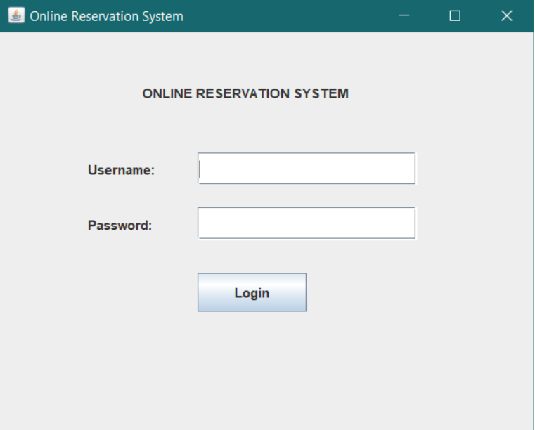
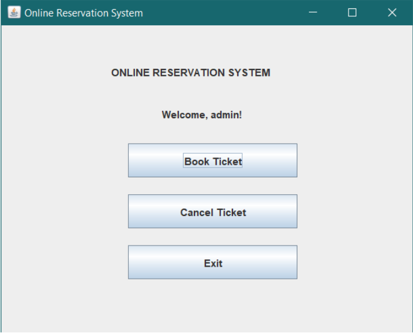
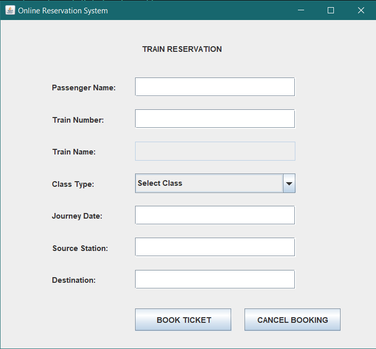
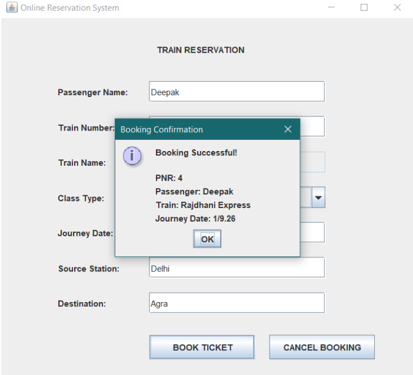
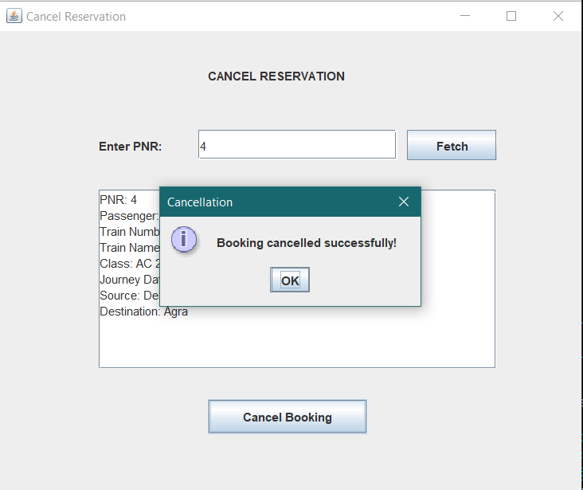

# Online Reservation System

A Java-based GUI application for managing train reservations. The system allows users to log in, book train tickets, generate unique PNR numbers, retrieve booking details using a PNR number, and cancel reservations.

## 📌 Project Overview

The **Online Reservation System** is a desktop-based train reservation application developed using **Java Swing, JDBC, and SQLite**.

The application provides a simple interface where users can:

* Log in using valid credentials
* Access a dashboard
* Book train tickets
* Enter passenger and journey details
* Automatically populate the train name based on the train number
* Validate reservation details
* Generate a unique PNR number
* Store reservation data in an SQLite database
* Retrieve booking details using a PNR number
* Cancel existing reservations
* Exit the application

## ✨ Features

### 1. Login Form

* Username and password authentication
* Credentials are checked against the SQLite database
* Invalid credentials are rejected
* Successful login opens the dashboard

### 2. Dashboard

After successful login, the user can choose from:

* **Book Ticket**
* **Cancel Ticket**
* **Exit**

### 3. Reservation Form

The booking form contains:

* Passenger Name
* Train Number
* Train Name
* Class Type
* Journey Date
* Source Station
* Destination Station

### 4. Automatic Train Name

The train name is automatically populated based on the entered train number.

Example:

| Train Number | Train Name       |
| ------------ | ---------------- |
| 12345        | Rajdhani Express |
| 12001        | Shatabdi Express |
| 12951        | Mumbai Rajdhani  |

The train name field is read-only and cannot be manually edited.

### 5. Input Validation

The system validates:

* Required fields are not empty
* Train number is numeric
* Journey date follows `DD/MM/YYYY` format
* Invalid dates are rejected
* Required reservation information is provided before booking

### 6. Ticket Booking

When the user clicks **Book Ticket**:

1. The reservation details are validated.
2. The details are inserted into the SQLite database.
3. A unique PNR is generated automatically.
4. A confirmation dialog displays the booking details.

### 7. PNR Generation

Each reservation receives a unique PNR number generated by SQLite using an auto-incrementing primary key.

### 8. Booking Confirmation

After a successful booking, the application displays:

* PNR
* Passenger name
* Train name
* Journey date
* Booking confirmation message

### 9. Ticket Cancellation

Users can cancel a reservation using the PNR number.

The process is:

1. Enter the PNR number.
2. Click **Fetch**.
3. View the complete booking details.
4. Click **Cancel Booking**.
5. Confirm the cancellation.
6. The reservation is deleted from the database.

### 10. Database

The application uses **SQLite**, so no separate database server is required.

The database file is:

```text
reservation.db
```

The database contains:

```text
users
reservations
```

---

## 🛠️ Technologies Used

* **Java** – Application development
* **Java Swing** – GUI development
* **JDBC** – Database connectivity
* **SQLite** – Database storage
* **Maven** – Dependency management
* **SQL** – Database operations
* **PreparedStatement** – Parameterized SQL queries

---

## 📂 Project Structure

```text
OnlineReservationSystem/
│
├── pom.xml
├── README.md
├── reservation.db
│
└── src/
    └── main/
        └── java/
            ├── Main.java
            ├── DBConnection.java
            ├── DatabaseSetup.java
            ├── UserSetup.java
            ├── LoginService.java
            ├── Dashboard.java
            ├── ReservationForm.java
            ├── ReservationSetup.java
            ├── ReservationService.java
            ├── CancellationForm.java
            └── CancellationService.java
```

## 📄 File Descriptions

### `Main.java`

The entry point of the application. It initializes the database and starts the login interface.

### `DBConnection.java`

Establishes the connection between the Java application and the SQLite database.

### `DatabaseSetup.java`

Creates the `users` table if it does not already exist.

### `UserSetup.java`

Creates/inserts the default login credentials used for testing.

### `LoginService.java`

Validates the username and password against the database.

### `Dashboard.java`

Displays the main dashboard after successful login and provides navigation to booking, cancellation, and exit options.

### `ReservationForm.java`

Provides the graphical interface for entering passenger and journey details.

It also performs input validation and handles the booking process.

### `ReservationSetup.java`

Creates the `reservations` table in the SQLite database.

### `ReservationService.java`

Handles inserting reservation information into the database and retrieving the generated PNR.

### `CancellationForm.java`

Provides the graphical interface for entering a PNR and retrieving booking details.

### `CancellationService.java`

Handles fetching reservation information and deleting reservations from the database.

---

## 🗄️ Database Design

### Users Table

```text
users
--------------------------------
id
username
password
```

### Reservations Table

```text
reservations
--------------------------------
pnr
passenger_name
train_number
train_name
class_type
journey_date
source
destination
```

### Reservation Table SQL Structure

```sql
CREATE TABLE IF NOT EXISTS reservations (
    pnr INTEGER PRIMARY KEY AUTOINCREMENT,
    passenger_name TEXT NOT NULL,
    train_number INTEGER NOT NULL,
    train_name TEXT NOT NULL,
    class_type TEXT NOT NULL,
    journey_date TEXT NOT NULL,
    source TEXT NOT NULL,
    destination TEXT NOT NULL
);
```

---

## 🔐 Default Login Credentials

For testing purposes:

```text
Username: admin
Password: 1234
```

> This is an educational project. In a production application, passwords should be securely hashed instead of being stored as plain text.

---

## ⚙️ Requirements

Before running the project, make sure you have:

* Java JDK 22 or compatible version
* Apache Maven 3.9 or later
* Visual Studio Code or another Java IDE
* Windows/Linux/macOS
* Internet connection for the first Maven dependency download

Check Java installation:

```bash
java -version
```

Check Maven installation:

```bash
mvn -version
```

---

## 📦 Maven Dependency

The project uses the SQLite JDBC driver.

Add the following dependency to `pom.xml`:

```xml
<dependency>
    <groupId>org.xerial</groupId>
    <artifactId>sqlite-jdbc</artifactId>
    <version>3.53.1.0</version>
</dependency>
```

Maven automatically downloads the required SQLite JDBC dependency.

---

## 🚀 How to Run the Project

### Step 1: Open the Project

Open the `OnlineReservationSystem` folder in VS Code.

### Step 2: Open the Terminal

Navigate to the project directory:

```bash
cd OnlineReservationSystem
```

### Step 3: Build the Project

Run:

```bash
mvn clean package
```

### Step 4: Run the Application

Run `Main.java` from VS Code.

The application will initialize the SQLite database and open the login form.

### Step 5: Login

Use:

```text
Username: admin
Password: 1234
```

After successful login, the dashboard will appear.

---

## 🔄 Application Workflow

```text
                    ┌───────────────┐
                    │     LOGIN     │
                    └───────┬───────┘
                            │
                            ▼
                  Validate Credentials
                            │
                            ▼
                    ┌───────────────┐
                    │   DASHBOARD   │
                    └───────┬───────┘
                            │
              ┌─────────────┼─────────────┐
              │             │             │
              ▼             ▼             ▼
        Book Ticket    Cancel Ticket     Exit
              │             │
              ▼             ▼
      Reservation Form   Enter PNR
              │             │
              ▼             ▼
       Validate Details  Fetch Booking
              │             │
              ▼             ▼
        Save to SQLite   Show Details
              │             │
              ▼             ▼
        Generate PNR    Confirm Cancellation
              │             │
              ▼             ▼
       Booking Success   Delete Record
```

---

## 🎫 Booking Flow

```text
Enter Passenger Details
          ↓
Enter Train Number
          ↓
Train Name Automatically Populated
          ↓
Select Class
          ↓
Enter Journey Date
          ↓
Enter Source & Destination
          ↓
Input Validation
          ↓
Save Reservation
          ↓
Generate PNR
          ↓
Display Confirmation
```

---

## ❌ Cancellation Flow

```text
Enter PNR
    ↓
Click Fetch
    ↓
Retrieve Booking from Database
    ↓
Display Booking Details
    ↓
Click Cancel Booking
    ↓
"Are you sure?" Confirmation
    ↓
Delete Reservation
    ↓
Display Cancellation Message
```

---

## 🔒 SQL Injection Prevention

The project uses `PreparedStatement` for database operations.

Example:

```java
String sql = "SELECT * FROM users WHERE username = ? AND password = ?";

PreparedStatement statement =
        connection.prepareStatement(sql);

statement.setString(1, username);
statement.setString(2, password);
```

Using parameterized queries prevents user input from being directly concatenated into SQL statements and helps protect against SQL injection.

---

## 🖥️ GUI Components Used

The application uses Java Swing components including:

* `JFrame`
* `JLabel`
* `JTextField`
* `JPasswordField`
* `JButton`
* `JComboBox`
* `JTextArea`
* `JScrollPane`
* `JOptionPane`

These components are used to create the login, dashboard, reservation, and cancellation interfaces.

---

## ☕ Java Concepts Used

This project demonstrates:

* Classes and objects
* Methods
* Encapsulation
* Exception handling
* `if-else`
* `switch`
* Loops
* Lambda expressions
* JDBC
* SQL
* `PreparedStatement`
* Event handling
* GUI programming
* Database operations
* Maven dependency management

---

## 🧪 Testing

### Login Tests

| Test Case                     | Expected Result  |
| ----------------------------- | ---------------- |
| Correct username and password | Login successful |
| Incorrect password            | Access denied    |
| Invalid username              | Access denied    |

### Reservation Tests

| Test Case                 | Expected Result      |
| ------------------------- | -------------------- |
| Empty required field      | Booking rejected     |
| Non-numeric train number  | Booking rejected     |
| Invalid date              | Booking rejected     |
| Valid date                | Accepted             |
| Valid reservation details | Booking successful   |
| Successful booking        | Unique PNR generated |

### Cancellation Tests

| Test Case            | Expected Result           |
| -------------------- | ------------------------- |
| Invalid PNR          | Booking not found         |
| Valid PNR            | Booking details displayed |
| Confirm cancellation | Booking deleted           |
| Search cancelled PNR | Booking not found         |

---

## ✅ Task Requirements Completed

* [x] Login Form
* [x] Username and password fields
* [x] Invalid credential handling
* [x] Reservation Form
* [x] Passenger name
* [x] Train number
* [x] Train name auto-populated from train number
* [x] Class type
* [x] Journey date
* [x] Source station
* [x] Destination station
* [x] Book/Insert button
* [x] Database storage
* [x] Automatic PNR generation
* [x] Booking confirmation dialog
* [x] Cancellation Form
* [x] PNR input field
* [x] Fetch booking details
* [x] Cancellation confirmation dialog
* [x] Remove booking from database
* [x] Empty-field validation
* [x] Valid date format validation
* [x] Numeric train number validation
* [x] JDBC
* [x] SQLite
* [x] PreparedStatement

---

## 📸 Screenshots

Screenshots of the application can be added here.

### Login Screen




### Dashboard



### Reservation Form



### Booking Confirmation



### Cancellation Form




---

## 🔮 Future Improvements

The following features could be added in future versions:

* Secure password hashing
* User registration
* Admin and user roles
* More train routes
* Real-time train information
* Seat availability
* Seat selection
* Fare calculation
* Payment integration
* PDF ticket generation
* Email/SMS booking confirmation
* Calendar-based date selection
* Booking history
* Logout functionality
* Improved GUI styling
* Database backup and recovery

---

## 📚 Learning Outcomes

Through this project, I gained practical experience in:

* Developing desktop applications using Java Swing
* Connecting Java applications to SQLite using JDBC
* Performing SQL CRUD operations
* Using `PreparedStatement`
* Implementing input validation
* Handling GUI events
* Working with multiple Java classes
* Managing Maven dependencies
* Designing a simple database structure
* Building a complete application from a feature specification

---

## 👤 Author

**Aarya Patel**

B.Tech – Computer Science and Engineering (AI & Machine Learning)

---

## 📄 License

This project was developed as part of a Java Development internship/task and is intended for educational and learning purposes.
