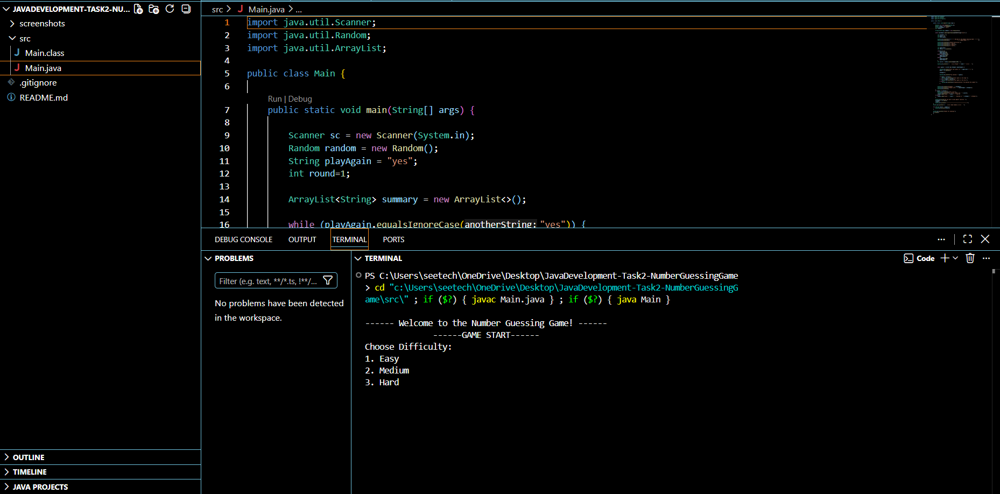
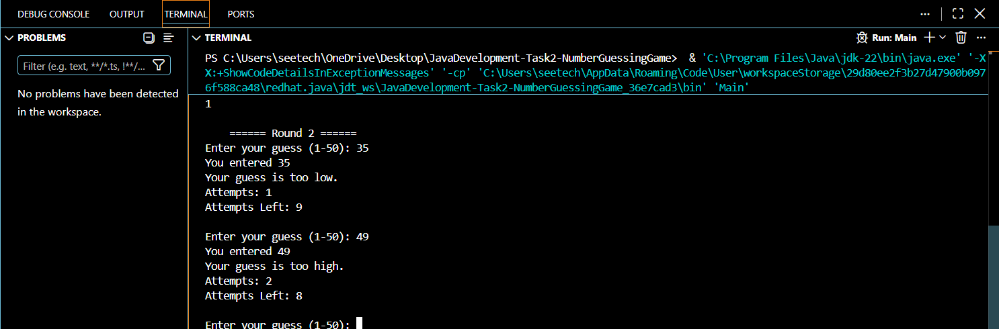
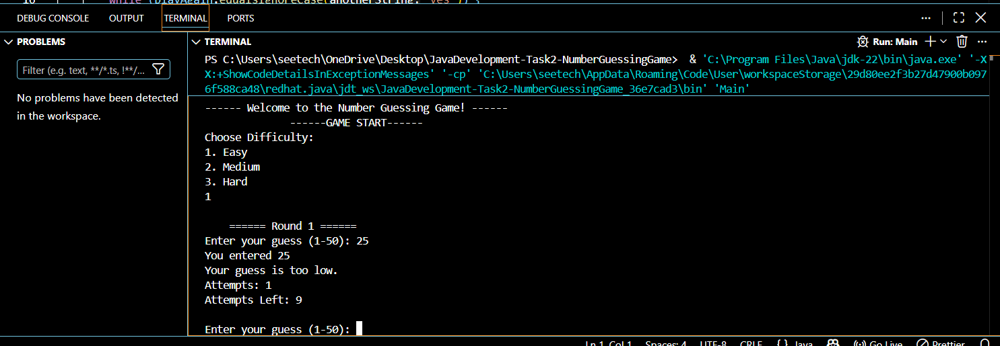
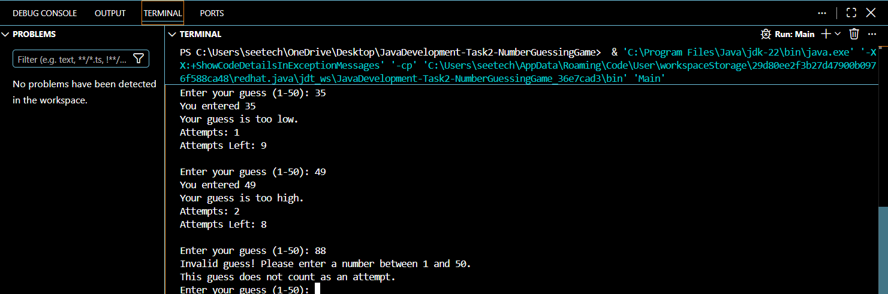
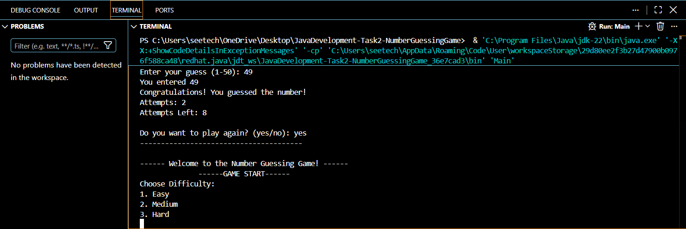
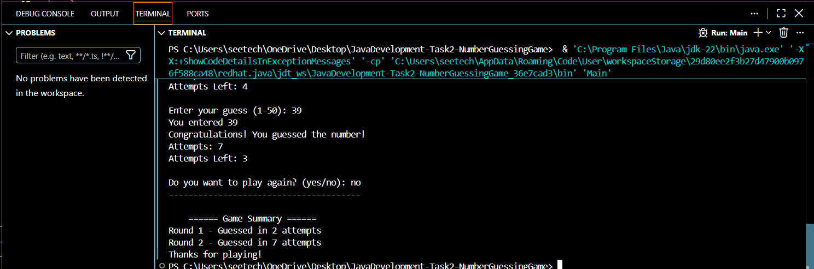

Absolutely — copy **everything inside the box** below and paste it directly into your `README.md`.

````markdown
# Number Guessing Game

A console-based Number Guessing Game developed using Java. The computer generates a random number between 1 and 100, and the player attempts to guess it within a maximum of 7 attempts.

The game provides hints after every guess and allows the player to play multiple rounds while keeping track of the round number and attempts used.

---

## 📌 Project Overview

The Number Guessing Game is a simple Java console application designed to demonstrate fundamental Java programming concepts such as:

- Random number generation
- User input using Scanner
- while loops
- if-else statements
- Variables
- Counters
- String comparison
- Multiple rounds
- Basic game logic

At the beginning of every round, the system generates a random number between 1 and 100.

The player has a maximum of 7 attempts to guess the number.

After every guess, the application tells the player whether the guess is too high, too low, or correct.

---

## ✨ Features

### 1. Random Number Generation

The application generates a random number between 1 and 100 at the beginning of every round.

```java
int secret = random.nextInt(100) + 1;
````

### 2. User Input

The player enters a guess using Java's `Scanner` class.

Example:

```text
Enter your guess: 55
```

### 3. Guess Feedback

The application provides three possible responses:

```text
Your guess is too high.
```

```text
Your guess is too low.
```

```text
Congratulations! You guessed the number!
```

### 4. Attempt Counter

The number of attempts used is displayed after every guess.

Example:

```text
Attempts: 3
Attempts Left: 4
```

### 5. Maximum Attempts

The player has a maximum of 7 attempts per round.

If the player does not guess the number within 7 attempts, the game ends the round and displays:

```text
You Lost!
The correct number was: 42
```

### 6. Play Again

After every round, the player can choose whether to play again.

```text
Do you want to play again? (yes/no):
```

Entering `yes` starts a new round with a new random number.

Entering `no` ends the game.

### 7. Round Tracking

The game keeps track of the current round.

Example:

```text
========== Round 1 ==========
```

At the end of a successful round:

```text
Round 1 - Guessed in 4 attempts
```

---

## 🛠️ Technologies Used

* Java
* Java Scanner
* Java Random
* Console / Command Line Interface

---

## 📂 Project Structure

```text
JavaDevelopment-Task2-NumberGuessingGame/
│
├── README.md
├── .gitignore
├── screenshots/
│   ├── game-start.png
│   ├── high-guess.png
│   ├── low-guess.png
│   ├── correct-guess.png
│   └── game-over.png
│
└── src/
    └── Main.java
```

---

## 🚀 How to Run the Project

### Prerequisites

Make sure Java is installed on your system.

Check your Java version using:

```bash
java -version
```

### Steps

1. Clone or download the repository.
2. Open the project folder in VS Code or any Java IDE.
3. Open the terminal.
4. Compile the Java file:

```bash
javac src/Main.java
```

5. Run the program:

```bash
java -cp src Main
```

---

## 🎮 How the Game Works

The application follows these steps:

1. Start the application.
2. Generate a random number between 1 and 100.
3. Start a new round.
4. Ask the user to enter a guess.
5. Compare the guess with the secret number.
6. Display:

   * Too High
   * Too Low
   * Correct
7. Increase the attempt counter.
8. Continue until:

   * The player guesses correctly, or
   * The player reaches 7 attempts.
9. Display the round result.
10. Ask whether the player wants to play again.
11. Generate a new number if another round is started.

---

## 🔄 Game Flow

```text
              START
                │
                ▼
       Generate Random Number
           1 to 100
                │
                ▼
          Start New Round
                │
                ▼
          Enter Guess
                │
                ▼
        Compare With Number
          /      |       \
         /       |        \
        ▼        ▼         ▼
    Too High  Too Low   Correct
        │        │         │
        └────────┴─────────┘
                 │
                 ▼
          Increase Attempt
                 │
                 ▼
        Attempts < 7 ?
           /          \
         Yes           No
          │             │
          ▼             ▼
      Guess Again     You Lost
                        │
                        ▼
                 Show Correct Number
                        │
                        ▼
                  Play Again?
                   /       \
                 Yes        No
                  │          │
                  ▼          ▼
              New Round    Exit
```

---

## 🧠 Java Concepts Used

### Random

The `Random` class is used to generate the secret number.

```java
Random random = new Random();

int secret = random.nextInt(100) + 1;
```

`nextInt(100)` generates a value from 0 to 99.

Adding 1 changes the range to:

```text
1 to 100
```

### Scanner

The `Scanner` class is used to read the player's input.

```java
Scanner sc = new Scanner(System.in);

int guess = sc.nextInt();
```

### while Loop

A `while` loop is used to continue accepting guesses until the player guesses correctly or reaches the maximum number of attempts.

```java
while (guess != secret && attempts < maxAttempts) {
    // game logic
}
```

### if-else

The guess is compared with the secret number:

```java
if (guess > secret) {
    System.out.println("Your guess is too high.");
} else if (guess < secret) {
    System.out.println("Your guess is too low.");
} else {
    System.out.println("Congratulations! You guessed the number!");
}
```

---

## 🧪 Example Gameplay

```text
========== Round 1 ==========

Enter your guess: 50
You entered 50
Your guess is too low.
Attempts: 1
Attempts Left: 6

Enter your guess: 75
You entered 75
Your guess is too high.
Attempts: 2
Attempts Left: 5

Enter your guess: 63
You entered 63
Congratulations! You guessed the number!
Attempts: 3
Attempts Left: 4

Round 1 - Guessed in 3 attempts

Do you want to play again? (yes/no): yes
```

---

## ❌ Example of Losing

```text
========== Round 1 ==========

Enter your guess: 10
Your guess is too low.

Enter your guess: 20
Your guess is too low.

Enter your guess: 30
Your guess is too high.

...

Attempts: 7
Attempts Left: 0

You Lost!
The correct number was: 42

Round 1 - Lost

Do you want to play again? (yes/no): no

Thanks for playing!
```

---

## 📸 Screenshots

### Game Start



### Too High Feedback



### Too Low Feedback



### Invalid Number Entered



### Correct Guess



### Game Over



---

## ✅ Task Requirements Completed

* [x] System generates a random number between 1 and 100
* [x] User enters a guess using Scanner
* [x] Displays "Too High!" feedback
* [x] Displays "Too Low!" feedback
* [x] Displays "Correct!" feedback
* [x] Attempt counter
* [x] Maximum 7 attempts
* [x] "You Lost!" message
* [x] Reveals the correct number after losing
* [x] Play Again option
* [x] Multiple rounds
* [x] Round number tracking
* [x] Displays attempts used in each round

---

## 🔮 Future Improvements

Possible future improvements include:

* GUI version using Java Swing
* Difficulty levels
* Score system based on attempts
* High-score tracking
* Input validation for non-numeric input
* Timer-based gameplay
* Different number ranges
* Leaderboard

---

## 📚 Learning Outcomes

Through this project, I gained practical experience with:

* Java console application development
* Random number generation
* User input handling
* Conditional statements
* Loops
* Counters
* Game logic
* Multiple-round program design
* Basic Java problem solving

---

## 👤 Author

**Aarya Patel**

B.Tech – Computer Science and Engineering (AI & Machine Learning)

---

## 📄 License

This project was developed as part of a Java Development internship/task and is intended for educational and learning purposes.

```
```
